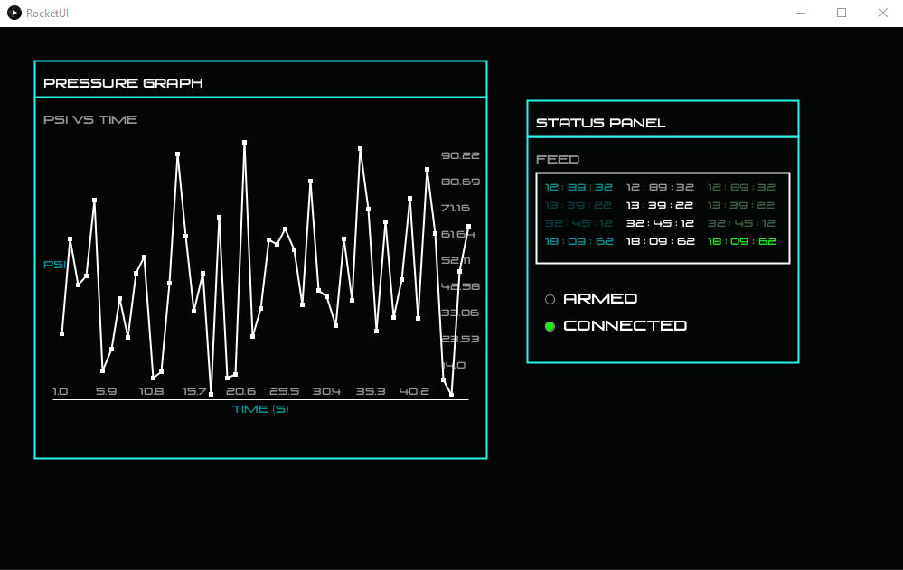

# Self Landing Rocket UI Kit

## About

UI kit developed by Jonathan Q for UBCO Aerospace club's self landing rocket project in Processing. Design inspried by [The Martian's](https://www.imdb.com/title/tt3659388/) UI.

## Snap Shots:


## Quick setup example:

```Java
void setup()
{
  surface.setResizable(true);
  size(1000, 600);
  frameRate(Env.fps);
  textFont(createFont("venus rising rg.ttf", 32));
  
  drawTestBasicUI();
}

void draw()
{
  // to clear the previously drawn items
  background(theme.pallet[0]);

  // loop for events such as draggable
  UILoop();
}

void drawTestBasicUI()
{
  // setup parent UI called ui which is a DRectUI for Draggable Rect UI
  DRectUI ui = new DRectUI(new Vector2(10, 10), new Vector2Int(300, 250), "Status Panel");

  // Text ui to lable the box / rect declared in next line
  TextUI boxLable = new TextUI(new Vector2(10, 10), new Vector2(0, 60), "Feed", 12, 5);

  // Box UI to organize the texts declared in the 3 lines after this 
  RectUI box = new RectUI(new Vector2(10, 10), new Vector2Int(280, 100), new Vector2(10, 80), 1, 2);

  // Texts in different color
  TextUI text1 = new TextUI(new Vector2(10, 10), new Vector2(10, 90), "12 : 89 : 32", 10, 2);
  TextUI text2 = new TextUI(new Vector2(10, 10), new Vector2(100, 90), "12 : 89 : 32", 10, 5);
  TextUI text3 = new TextUI(new Vector2(10, 10), new Vector2(190, 90), "12 : 89 : 32", 10, 4);
  
  // Indicator UI, the green / blank circle
  IndicatorUI isArmed = new IndicatorUI(new Vector2(10, 10), new Vector2(15, 210));
  IndicatorUI isConnected = new IndicatorUI(new Vector2(10, 10), new Vector2(15, 240));
  
  TextUI armedText = new TextUI(new Vector2(10, 10), new Vector2(30, 215), "ARMED", 15, 1);
  TextUI connectedText = new TextUI(new Vector2(10, 10), new Vector2(30, 245), "CONNECTED", 15, 1);
  
  // append all child to parent
  ui.addChild(boxLable);
  ui.addChild(box);
  
  ui.addChild(text1);
  ui.addChild(text2);  
  ui.addChild(text3);
  
  ui.addChild(isArmed);
  ui.addChild(isConnected);
  
  ui.addChild(armedText);
  ui.addChild(connectedText);
  
  // set indicator color to green
  isConnected.setFillColor(6);

  // recall UI to near center of screen
  ui.recall();
}
```

## Documentation

### Class: UI

An absract class, the parent class of all UI classes.

```Java
// Class simplified for understanding. Only fields and method signatures kept
abstract class UI  
{ 
  public Vector2 origin, offset;
  Vector2 drawOrigin;
  public float padding = 10f;
  private int index = -2, drawIndex = -1;
  private ArrayList<UI> childUIs;
  public Vector2Int dimension;

  UI(Vector2 origin, Vector2Int dimension, Vector2 offset)

  // must be called first in update() to update draw origin
  public void updateDrawOrigin()

  // return childUIs
  public ArrayList<UI> getChild()

  // adds child ui to childUIs
  public void addChild(UI ui)
  
  // removes child UI
  public void removeChild(UI ui)

  // return the index of this UI in UIManager.UIs
  public int getIndex()

  // place this UI at a random location near the center of the screen
  public void recall()
  
  // function called by loop to draw this UI
  public void update()
  
  // method for event handler for mouseOver events
  public abstract boolean mouseOver();
}
```

### Class: DraggableUI

An abstract class, child of UI. Parent of all UI elements that are draggable. Gives child UI a header banner that makes the child UI draggable by mouse and left click.

``` Java
// Class simplified for understanding. Only fields and method signatures kept
public abstract class DraggableUI extends UI
{
  public Vector2 topXClip, topYClip, botXClip, botYClip;
  public boolean draggable;
  public Vector2Int headerDim;
  public String header;
  
  DraggableUI(Vector2 origin, Vector2Int dimension, Vector2Int headerDim, String header, Vector2 offset) {}
  
  DraggableUI(Vector2 origin, Vector2Int dimension, String header) {}
  
  DraggableUI(Vector2 origin, Vector2Int dimension, Vector2 offset) {}
  
  // logic for when the cursor should change from ARROW to HAND and back
  @Override
  public boolean mouseOver()
  
  // logic for drawing the draggable banner
  @Override
  public void update()
}
```


